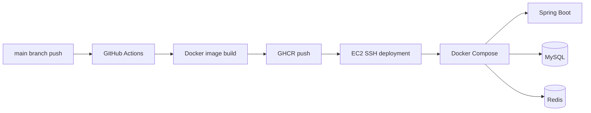

# TGG Chat

## 프로젝트 소개

WebSocket(STOMP)과 Redis Pub/Sub을 기반으로 구현한 실시간 채팅 백엔드입니다.

1대1·그룹 채팅, 사용자별 읽음 상태, 채팅방 퇴장과 재입장, JWT 세션 관리, 이미지·동영상·일반 파일 메시지를 지원합니다. 특히 채팅방 참여 상태에 따른 메시지 공개 범위와 사용자별 읽음 경계를 관리하는 데 중점을 두었습니다.

---

## 프로젝트 목표

### WebSocket/STOMP 기반 실시간 이벤트 전달

- 채팅 메시지, 메시지 읽음 상태, 채팅방 목록 변경, 사용자명·프로필 변경을 실시간 이벤트로 전달
- 이벤트의 역할에 따라 `ChatEvent`, `ChatRoomListEvent`, `UserMetadataEvent`로 모델을 분리
- 채팅방 구독자 전체에 전달되는 이벤트와 특정 사용자에게 전달되는 이벤트의 전송 경로를 구분
- Redis Pub/Sub을 통해 여러 서버 인스턴스가 동일한 이벤트를 공유할 수 있도록 구성

### 채팅방 퇴장 및 재참여에 따른 메시지 공개 범위 관리

- 채팅방에서 나간 사용자를 삭제하지 않고 `ACTIVE`, `LEFT` 상태로 관리
- `visibleStartMessageId`를 사용해 사용자마다 조회할 수 있는 메시지 시작 범위를 구분
- 사용자가 채팅방에 다시 참여하면 재참여 시점 이후의 메시지만 조회하도록 처리

### 사용자별 읽음 상태 관리

- `unreadStartMessageId`를 기준으로 사용자별 읽음 위치와 안 읽은 메시지 수 관리
- 읽음 요청 시 기존 값보다 큰 경우에만 조건부 UPDATE하여, 동시에 여러 요청이 들어와도 읽음 위치가 이전 값으로 되돌아가지 않도록 처리
- 변경된 읽음 위치를 채팅방 구독자에게 실시간 전달
- 요청 사용자에게는 읽음 위치와 안 읽은 메시지 수가 포함된 채팅방 목록 갱신 이벤트 전달

### JWT 기반 다중 로그인 세션 관리

- AccessToken과 RefreshToken을 용도별로 분리
- AccessToken은 Stateless하게 검증하고 RefreshToken은 Redis에 세션 단위로 저장
- JWT의 `sid`를 이용해 로그인 세션별 로그아웃과 RefreshToken 회전 처리
- 사용자별 세션을 최대 10개로 제한하고 오래된 세션부터 제거
- HTTP 요청은 Security Filter, STOMP 연결은 ChannelInterceptor에서 AccessToken 검증

### 이미지·동영상·일반 파일 메시지 처리

- 한 메시지에 최대 30개, 전체 3GB까지 파일을 첨부할 수 있도록 구성
- Apache Tika로 파일 형식을 판별하고 이미지, 동영상, 일반 파일로 분류
- Thumbnailator와 FFmpeg를 사용해 이미지·동영상 썸네일 생성
- 파일 처리 중 오류가 발생하면 이미 생성된 파일을 정리하도록 보상 처리
- MediaToken, 채팅방 참여 상태, 메시지 공개 범위를 검증한 후 파일 제공
- 프로필 이미지는 장기 Public Cache, 채팅 미디어는 단기 Private Cache 적용

---

## 기술 스택

| 구분 | 기술 |
|---|---|
| 백엔드 | Java 17, Spring Boot 3.5, Gradle |
| 데이터베이스 | MySQL 8, Spring Data JPA, MyBatis |
| 실시간 통신 | WebSocket, STOMP, Redis Pub/Sub |
| 인증·보안 | Spring Security, JWT |
| 파일 처리 | Apache Tika, Thumbnailator, FFmpeg |
| 배포·인프라 | Docker, Docker Compose, GitHub Actions, GHCR |

---

## 시스템 아키텍처


- Nginx가 정적 프론트엔드를 제공하고 REST API, 미디어, WebSocket 요청을 Spring Boot 컨테이너로 전달합니다.
- Spring Boot는 Docker Compose 내부 DNS를 통해 MySQL과 Redis에 연결합니다.
- MySQL·Redis·애플리케이션 로그는 Docker Volume에, 업로드 파일은 EC2 호스트의 bind mount 경로에 보존합니다.

---

## 데이터 모델 및 ERD


- `User`는 사용자 계정, 소프트 삭제 여부와 프로필 이미지 키를 관리합니다.
- `UserFriend`는 사용자 간 단방향 친구 관계를 표현하며, 동일한 친구 관계의 중복 저장을 방지합니다.
- `ChatRoom`은 `DIRECT`, `GROUP` 채팅방을 구분하고, 1대1 채팅방의 사용자 조합을 관리하여 중복 생성을 방지합니다.
- `ChatRoomUser`는 사용자와 채팅방의 참여 관계를 표현하며, 역할, 참여 상태, 읽지 않은 메시지의 시작 위치, 메시지 노출 시작 위치와 사용자별 채팅방 이름을 관리합니다.
- `ChatMessage`는 채팅방, 발신자, 메시지 내용과 타입을 관리하며, 데이터베이스가 생성한 ID를 메시지 식별자와 커서 조회 및 사용자별 읽음·노출 위치 판단 기준으로 사용합니다.
- `StoredFile`은 `fileKey`를 통해 메시지 첨부 파일 또는 프로필 이미지와 논리적으로 연결되며, 원본·썸네일 파일의 이름, 형식, 크기와 저장 정보를 관리합니다.

---

## 핵심 기능

### 사용자 및 인증

- 이메일 기반 회원가입과 BCrypt 비밀번호 해싱
- AccessToken, RefreshToken, MediaToken 분리
- `sid` 기반 다중 로그인 세션 관리
- RefreshToken 회전과 사용자별 최대 10개 세션 제한
- 세션 단위 로그아웃과 회원 삭제 시 전체 RefreshToken 제거
- 사용자명·프로필 이미지 변경 이벤트 실시간 전달

### 친구

- 사용자명 기반 단방향 친구 추가
- 삭제된 사용자를 제외한 친구 목록 조회
- 채팅방 유형과 참여 상태를 반영한 초대 가능 친구 조회

### 채팅방

- 1대1 및 그룹 채팅방 생성
- 기존 1대1 채팅방 재사용과 중복 생성 방지
- 1대1 채팅방에 사용자를 초대할 때 그룹 채팅방으로 전환
- 그룹 채팅방 초대, 퇴장, 방장 권한 양도
- 그룹 채팅방 공통 이름과 사용자별 개인 채팅방 이름 관리
- 퇴장·재입장 시 사용자별 메시지 공개 시작 위치를 재설정하여 이전 대화 노출 제한
- 사용자별 채팅방 목록과 최근 메시지, 안 읽은 메시지 수 조회

### 메시지 및 파일

- STOMP 기반 텍스트 메시지 전송
- 메시지 ID 기반 커서 조회와 요청당 최대 100개 메시지 반환
- 사용자별 읽음 위치 갱신과 실시간 읽음 이벤트 전달
- 이미지, 동영상, 일반 파일을 한 메시지에 최대 30개·총 3GB까지 첨부
- 이미지 및 동영상 썸네일 생성
- MediaToken 유효성, 채팅방 접근 권한, 사용자별 메시지 공개 범위를 검증한 파일 조회

---

## 주요 처리 흐름

### 메시지 전송


### 읽음 상태 갱신

1. 클라이언트가 마지막으로 읽은 `readMessageId`를 전송합니다.
2. 서버는 해당 메시지가 채팅방에 존재하고 사용자의 공개 범위 안에 있는지 검증합니다.
3. `readMessageId + 1`을 새로운 `unreadStartMessageId`로 계산합니다.
4. 기존 커서보다 새로운 값이 클 때만 조건부 UPDATE하여 커서가 과거로 돌아가지 않게 합니다.
5. 실제 DB 값과 안 읽은 메시지 수를 다시 조회해 채팅방 Topic과 사용자 목록 Queue에 전달합니다.

---

## 핵심 기술적 결정

| 문제 | 선택 | 이유와 트레이드오프 |
|---|---|---|
| 서버 인스턴스 간 실시간 이벤트 전달 | Redis Pub/Sub | 이벤트 보관과 재전송을 지원하지 않아 HTTP 이용한 재동기화 가 필요하다. |
| 메시지 순서 판단 | DB가 생성한 `chatMessageId` | 서버 시간이나 인스턴스별 시계에 의존하지 않고 하나의 증가하는 값을 식별자와 정렬 기준으로 사용한다. |
| 읽음 커서 동시성 | 조건부 UPDATE | 늦게 도착한 읽음 요청이 더 최신 커서를 과거 값으로 덮어쓰는 것을 방지한다. |
| 퇴장·재입장 처리 | 참여 행 유지 + 공개 범위 커서 갱신 | `ChatRoomUser`를 삭제하지 않고 `ACTIVE/LEFT` 상태와 `visibleStartMessageId`를 관리해 재입장 정책을 표현한다. |
| RefreshToken 관리 | JWT `sid` + Redis | AccessToken은 Stateless하게 검증하면서 세션별 로그아웃, RefreshToken 회전, 최대 세션 수 제한을 지원한다. |
| 미디어 접근 제어 | 짧은 MediaToken + 참여 상태 검증 | 브라우저의 ``·`<video>` 요청에서도 쿠키로 인증하면서 현재 채팅방 접근 권한과 메시지 공개 범위를 다시 검증한다. |
| 미디어 캐시 | 프로필은 장기 Public, 채팅 미디어는 단기 Private | 불변 프로필 키는 장기 캐시하고 권한이 필요한 채팅 미디어는 사용자 브라우저에만 짧게 캐시한다. |

---

## 배포 아키텍처 및 CI/CD



- `main` 브랜치 Push 또는 수동 실행으로 워크플로우가 시작됩니다.
- GitHub Actions가 Docker 이미지를 빌드해 GHCR에 Push합니다.
- 이후 EC2에 SSH로 접속해 Docker Compose의 이미지 Pull과 컨테이너 갱신 명령을 실행합니다.
- 애플리케이션 로그와 업로드 파일, MySQL·Redis 데이터는 컨테이너 외부 볼륨에 유지합니다.

---

## 현재 제약사항 및 개선 계획

- Redis Pub/Sub은 이벤트를 보관하지 않으므로 재연결 이후 HTTP API를 통한 상태 재동기화가 필요합니다.
- 내장 Simple Broker를 사용하므로 대규모 연결과 메시지 보존이 필요해지면 외부 STOMP Broker 도입을 검토해야 합니다.
- 채팅 이벤트와 채팅방 목록 이벤트가 서로 다른 Redis 채널을 사용하므로 일시적인 도착 순서 차이를 허용합니다.
- 업로드 파일을 서버 로컬 볼륨에 저장하므로 애플리케이션을 여러 인스턴스로 확장하려면 공유 스토리지 또는 오브젝트 스토리지가 필요합니다.

---

## API 사용 가이드

<details>
<summary><strong>시작하기</strong></summary>

### 요구 사항

- Java 17
- MySQL 8
- Redis 7
- FFmpeg

---

### 로컬 인프라

1. MySQL에 `chatdb` 데이터베이스를 생성합니다.
2. `application-local.yml`의 MySQL 접속 정보를 로컬 환경에 맞게 설정합니다.
3. MySQL은 기본 `3306`, Redis는 기본 `6379` 포트에서 실행합니다.
4. 업로드 파일을 저장할 디렉터리를 준비합니다.

---

### 필수 환경 변수

| 환경 변수 | 설명 |
|---|---|
| `SPRING_PROFILES_ACTIVE` | 로컬 실행 시 `local` |
| `SECRET` | JWT 서명에 사용할 최소 32바이트 문자열 |
| `FILE_ROOT_PATH` | 업로드 파일을 저장할 디렉터리의 절대 경로 |

Linux/macOS:

```bash
SPRING_PROFILES_ACTIVE=local \
SECRET="replace-with-at-least-32-byte-secret" \
FILE_ROOT_PATH="/absolute/path/to/files" \
./gradlew bootRun
```

Windows PowerShell:

```powershell
$env:SPRING_PROFILES_ACTIVE = "local"
$env:SECRET = "replace-with-at-least-32-byte-secret"
$env:FILE_ROOT_PATH = "C:\absolute\path\to\files"
.\gradlew.bat bootRun
```

애플리케이션이 실행되면 Swagger UI에서 REST API를 확인할 수 있습니다.

```text
http://localhost:8080/swagger-ui/index.html
```

</details>

<details>
<summary><strong>인터페이스 공통 규칙</strong></summary>

### Base URL

```text
http://localhost:8080
```

### 인증

보호된 HTTP API는 AccessToken을 Bearer 형식으로 전달합니다.

```http
Authorization: Bearer {accessToken}
```

| 토큰 | 전달 방식 | 용도 | 유효 시간 |
|---|---|---|---|
| AccessToken | 응답 Body → `Authorization` 헤더 | 보호된 REST API와 STOMP 연결 | 10분 |
| RefreshToken | HttpOnly Cookie | AccessToken 재발급 | 7일 |
| MediaToken | HttpOnly Cookie | 채팅 메시지 파일 조회 | 10분 |

쿠키를 사용하는 브라우저 요청은 Fetch의 `credentials: "include"` 또는 Axios의 `withCredentials: true` 설정이 필요합니다.

### 요청과 응답

- 기본 요청·응답 형식은 `application/json; charset=UTF-8`입니다.
- 파일 업로드는 `multipart/form-data`, 파일 조회는 실제 파일의 Content-Type 또는 `application/octet-stream`을 사용합니다.
- 성공 응답은 공통 Wrapper 없이 DTO, 배열 또는 빈 Body를 반환합니다.
- Enum은 대문자 문자열로 직렬화하며, 가능한 값과 의미는 Enum을 사용하는 API 명세에서 설명합니다.
- 사용자·인증 응답과 오류 응답의 시각은 `yyyy-MM-dd HH:mm:ss` 형식입니다.
- 채팅 응답과 STOMP 이벤트의 `LocalDateTime`은 기본 ISO-8601 형식으로 직렬화합니다.

### 공통 오류 응답

```json
{
  "code": "CR010",
  "status": 403,
  "message": "채팅방에 접근할 권한이 없습니다.",
  "timestamp": "2026-08-17 15:30:00"
}
```

| 필드 | 타입 | 설명 |
|---|---|---|
| `code` | String | 클라이언트에서 오류를 구분하기 위한 코드 |
| `status` | Number | 대응되는 HTTP 상태 코드 |
| `message` | String | 오류 설명 |
| `timestamp` | String | 오류 발생 시각 |

</details>

<details>
<summary><strong>REST API 명세</strong></summary>

### 엔드포인트 요약

| 도메인 | Method | 경로 | 인증 | 설명 |
|---|---|---|---|---|
| Auth | POST | `/login` | 공개 | 로그인 |
| Auth | POST | `/logout` | AccessToken | 현재 세션 로그아웃 |
| Auth | POST | `/refresh` | RefreshToken Cookie | 토큰 재발급 |
| User | POST | `/user` | 공개 | 회원가입 |
| User | GET | `/user/{userId}` | 공개 | 다른 사용자 조회 |
| User | GET | `/me` | AccessToken | 로그인 사용자 조회 |
| User | PATCH | `/me` | AccessToken | 사용자명 변경 |
| User | DELETE | `/me` | AccessToken | 회원 삭제 |
| User | PUT | `/me/profile-image` | AccessToken | 프로필 이미지 변경 |
| User | GET | `/profile-images/{fileKey}/thumbnail` | 공개 | 프로필 썸네일 조회 |
| User | GET | `/profile-images/{fileKey}/image` | 공개 | 프로필 원본 조회 |
| Friend | POST | `/friends` | AccessToken | 친구 추가 |
| Friend | GET | `/friends` | AccessToken | 친구 목록 조회 |
| ChatRoom | POST | `/directChatRooms` | AccessToken | 1대1 채팅방 생성·재입장 |
| ChatRoom | POST | `/groupChatRooms` | AccessToken | 그룹 채팅방 생성 |
| ChatRoom | POST | `/directChatRooms/{chatRoomId}/invites` | AccessToken | 1대1 방 초대 및 그룹 전환 |
| ChatRoom | POST | `/groupChatRooms/{chatRoomId}/invites` | AccessToken | 그룹 채팅방 초대 |
| ChatRoom | POST | `/chatRooms/{chatRoomId}/leave` | AccessToken | 채팅방 나가기 |
| ChatRoom | PATCH | `/chatRooms/{chatRoomId}/name` | AccessToken | 그룹 채팅방 기본 이름 변경 |
| ChatRoom | PATCH | `/chatRooms/{chatRoomId}/customName` | AccessToken | 개인 채팅방 이름 변경 |
| ChatRoom | GET | `/chatRooms/{chatRoomId}/invitableFriends` | AccessToken | 초대 가능 친구 조회 |
| ChatRoom | GET | `/chatRooms/{chatRoomId}/members` | AccessToken | 채팅방 참여자 조회 |
| ChatRoom | GET | `/chatRooms/{chatRoomId}/readStatuses` | AccessToken | 참여자별 읽음 범위 조회 |
| ChatRoom | GET | `/chatRooms` | AccessToken | 내 채팅방 목록 조회 |
| Message | GET | `/chatRooms/{chatRoomId}/messages` | AccessToken | 채팅 메시지 조회 |
| File | POST | `/chatRooms/{chatRoomId}/files` | AccessToken | 파일 메시지 전송 |
| File | GET | `/media/messages/{chatMessageId}/files/{fileOrder}` | MediaToken Cookie | 메시지 파일 조회 |

### 인증 API

#### `POST /login`

```json
{
  "email": "user@example.com",
  "password": "password"
}
```

성공 시 AccessToken을 Body로 반환하고 RefreshToken과 MediaToken을 HttpOnly Cookie로 설정합니다.

```json
{
  "accessToken": "eyJ..."
}
```

#### `POST /logout`

AccessToken으로 식별한 현재 `sid`의 RefreshToken을 Redis에서 제거하고 RefreshToken·MediaToken Cookie를 만료시킵니다. 성공 응답 Body는 없습니다.

#### `POST /refresh`

요청 Body 없이 RefreshToken Cookie를 사용합니다. 기존 RefreshToken과 동일한 `sid`로 토큰을 회전합니다.

```json
{
  "accessToken": "eyJ..."
}
```

응답에서 새로운 RefreshToken과 MediaToken Cookie도 함께 설정합니다.

### 사용자 API

#### `POST /user`

```json
{
  "email": "user@example.com",
  "password": "password",
  "username": "user1"
}
```

```json
{
  "userId": 1,
  "username": "user1",
  "createdAt": "2026-08-17 15:30:00",
  "updatedAt": "2026-08-17 15:30:00"
}
```

#### `GET /user/{userId}`

```json
{
  "userId": 2,
  "username": "user2",
  "createdAt": "2026-08-17 15:30:00",
  "updatedAt": "2026-08-17 15:30:00"
}
```

#### `GET /me`

```json
{
  "userId": 1,
  "email": "user@example.com",
  "username": "user1",
  "profileImageKey": "user:1:550e8400-e29b-41d4-a716-446655440000",
  "createdAt": "2026-08-17 15:30:00",
  "updatedAt": "2026-08-17 15:30:00"
}
```

#### `PATCH /me`

```json
{
  "username": "newUsername"
}
```

성공 응답 Body는 없습니다. 사용자명 변경은 상호작용한 사용자의 `/user/queue/users/metadata` 구독에도 전달됩니다.

#### `DELETE /me`

사용자를 소프트 삭제하고 Redis의 모든 RefreshToken 세션을 제거합니다. 성공 응답 Body는 없습니다.

#### `PUT /me/profile-image`

`multipart/form-data`의 `userProfileImage` Part에 JPG, PNG, GIF 또는 WebP 이미지를 전달합니다. 성공 응답 Body는 없습니다.

#### `GET /profile-images/{fileKey}/thumbnail`

JPEG 썸네일 바이너리를 반환합니다. 응답은 Public·Immutable 정책으로 최대 365일 캐시합니다.

#### `GET /profile-images/{fileKey}/image`

프로필 원본 이미지 바이너리와 실제 이미지 Content-Type을 반환합니다. 응답은 Public·Immutable 정책으로 최대 365일 캐시합니다.

### 친구 API

#### `POST /friends`

친구 관계는 요청 사용자를 기준으로 하는 단방향 관계입니다.

```json
{
  "username": "user2"
}
```

성공 응답 Body는 없습니다.

#### `GET /friends`

```json
[
  {
    "friendId": 2,
    "friendUsername": "user2",
    "profileImageKey": "user:2:550e8400-e29b-41d4-a716-446655440001"
  }
]
```

### 채팅방 API

#### `POST /directChatRooms`

```json
{
  "friendId": 2
}
```

```json
{
  "chatRoomId": 10
}
```

동일한 두 사용자 사이에 기존 1대1 채팅방이 있으면 새로 만들지 않고 기존 채팅방을 사용합니다.

#### `POST /groupChatRooms`

`friendIds`에는 요청 사용자를 제외한 친구 ID를 전달합니다. 중복 ID는 서버에서 제거합니다.

```json
{
  "friendIds": [2, 3],
  "chatRoomName": "백엔드 스터디"
}
```

```json
{
  "chatRoomId": 11
}
```

#### `POST /directChatRooms/{chatRoomId}/invites`

1대1 채팅방에 기존 참여자가 아닌 사용자를 한 명 이상 초대하고 그룹 채팅방으로 전환합니다.

```json
{
  "friendIds": [3, 4]
}
```

성공 응답 Body는 없습니다.

#### `POST /groupChatRooms/{chatRoomId}/invites`

그룹 채팅방에 신규 사용자를 초대하거나 `LEFT` 상태의 기존 사용자를 복귀시킵니다.

```json
{
  "friendIds": [3, 4]
}
```

성공 응답 Body는 없습니다.

#### `POST /chatRooms/{chatRoomId}/leave`

그룹 채팅방의 방장이 나가고 다른 활성 사용자가 남아 있다면 `nextOwnerId`가 필요합니다. 그 외에는 빈 객체를 전달할 수 있습니다.

```json
{
  "nextOwnerId": 2
}
```

성공 응답 Body는 없습니다.

#### `PATCH /chatRooms/{chatRoomId}/name`

그룹 채팅방의 `OWNER`만 공통 이름을 변경할 수 있습니다.

```json
{
  "roomName": "새 그룹 이름"
}
```

성공 응답 Body는 없습니다.

#### `PATCH /chatRooms/{chatRoomId}/customName`

1대1·그룹 채팅방 모두 사용할 수 있으며 요청 사용자에게만 적용됩니다.

```json
{
  "customRoomName": "내가 정한 이름"
}
```

성공 응답 Body는 없습니다.

#### `GET /chatRooms/{chatRoomId}/invitableFriends`

```json
[
  {
    "userId": 3,
    "username": "user3",
    "profileImageKey": "user:3:550e8400-e29b-41d4-a716-446655440002"
  }
]
```

#### `GET /chatRooms/{chatRoomId}/members`

```json
[
  {
    "userId": 1,
    "username": "user1",
    "profileImageKey": "user:1:550e8400-e29b-41d4-a716-446655440000",
    "chatRoomUserRole": "OWNER",
    "canAddFriend": false
  }
]
```

`chatRoomUserRole`의 가능한 값:

| 값 | 의미 |
|---|---|
| `OWNER` | 그룹 채팅방 방장 |
| `MEMBER` | 일반 참여자. 1대1 채팅방의 두 사용자도 `MEMBER`입니다. |

#### `GET /chatRooms/{chatRoomId}/readStatuses`

```json
[
  {
    "userId": 1,
    "unreadStartMessageId": 151
  },
  {
    "userId": 2,
    "unreadStartMessageId": 145
  }
]
```

`unreadStartMessageId`를 포함한 이후 메시지를 해당 사용자가 읽지 않은 것으로 판단합니다.

#### `GET /chatRooms`

현재 `ACTIVE` 상태로 참여한 채팅방을 `lastActivityAt` 내림차순으로 반환합니다.

```json
[
  {
    "roomId": 10,
    "roomType": "GROUP",
    "baseRoomName": "백엔드 스터디",
    "customRoomName": null,
    "myRole": "OWNER",
    "memberCount": 3,
    "previewUsers": [
      {
        "userId": 2,
        "username": "user2",
        "profileImageKey": "user:2:550e8400-e29b-41d4-a716-446655440001"
      }
    ],
    "lastMessagePreview": "안녕하세요",
    "messageId": 150,
    "lastActivityAt": "2026-08-17T15:30:00",
    "unreadStartMessageId": 148,
    "unreadCount": 3
  }
]
```

`roomType`의 가능한 값:

| 값 | 의미 |
|---|---|
| `DIRECT` | 1대1 채팅방 |
| `GROUP` | 그룹 채팅방 |

`myRole`의 가능한 값은 `OWNER`, `MEMBER`입니다. `baseRoomName`, `customRoomName`, 최근 메시지 관련 필드는 값이 없으면 `null`일 수 있습니다.

### 메시지 API

#### `GET /chatRooms/{chatRoomId}/messages`

| Query Parameter | 필수 | 설명 |
|---|---|---|
| `offsetMessageId` | 아니요 | 전달하면 해당 ID보다 작은 이전 메시지를 조회합니다. |

최신 메시지부터 `messageId` 내림차순으로 최대 100개를 반환합니다.

```json
[
  {
    "messageId": 150,
    "chatMessageType": "TEXT",
    "content": "안녕하세요",
    "senderId": 1,
    "senderName": "user1",
    "senderProfileImageKey": "user:1:550e8400-e29b-41d4-a716-446655440000",
    "createdAt": "2026-08-17T15:30:00",
    "chatEventFiles": []
  }
]
```

`chatMessageType`의 가능한 값:

| 값 | 의미 |
|---|---|
| `TEXT` | 일반 텍스트 메시지 |
| `FILE` | 파일 첨부 메시지 |
| `JOIN_TEXT` | 참여 안내 메시지 |
| `LEAVE_TEXT` | 퇴장 안내 메시지 |

삭제된 발신자의 메시지는 유지되지만 `senderId`, `senderName`, `senderProfileImageKey`는 `null`로 반환합니다.

파일 메시지의 `chatEventFiles` 항목:

```json
{
  "fileOrder": 1,
  "fileCategory": "IMAGE",
  "originalFileName": "photo.png",
  "fileSize": 204800
}
```

`fileCategory`의 가능한 값:

| 값 | 의미 |
|---|---|
| `IMAGE` | 이미지 파일 |
| `VIDEO` | 동영상 파일 |
| `FILE` | 그 외 일반 파일 |

### 파일 API

#### `POST /chatRooms/{chatRoomId}/files`

`multipart/form-data`의 `files` Part에 1개 이상 30개 이하의 파일을 전달합니다. 전체 파일 크기는 최대 3GB입니다. 성공 응답 Body는 없으며 저장된 파일 메시지는 STOMP 이벤트로 전달됩니다.

#### `GET /media/messages/{chatMessageId}/files/{fileOrder}`

MediaToken Cookie가 필요합니다.

| Query Parameter | 필수 | 가능한 값 | 설명 |
|---|---|---|---|
| `storedFileVariant` | 예 | `ORIGINAL`, `THUMBNAIL` | 원본 또는 썸네일 선택 |

```text
GET /media/messages/150/files/1?storedFileVariant=THUMBNAIL
```

`IMAGE`, `VIDEO`는 해당 Content-Type으로 인라인 응답하고 10분간 Private Cache를 적용합니다. 일반 `FILE`은 `application/octet-stream`과 Attachment 형식으로 내려받습니다.

</details>

<details>
<summary><strong>WebSocket/STOMP 명세</strong></summary>

### 연결

| 항목 | 값 |
|---|---|
| SockJS Endpoint | `/ws` |
| STOMP CONNECT Header | `Authorization: Bearer {accessToken}` |
| Client SEND Prefix | `/app` |
| Broker Prefix | `/topic`, `/queue` |
| User Destination Prefix | `/user` |

권장 연결 순서:

```text
POST /login으로 AccessToken 획득
→ /ws에 SockJS 연결
→ Authorization 헤더를 포함해 STOMP CONNECT
→ 사용자 Queue 구독
→ GET /chatRooms로 초기 상태 조회
→ 채팅방 입장 시 Topic 구독
```

### 클라이언트 → 서버

| 목적 | SEND 경로 | Payload |
|---|---|---|
| 텍스트 메시지 전송 | `/app/chatRooms/{chatRoomId}/message` | `ChatMessageRequest` |
| 읽음 처리 | `/app/chatRooms/{chatRoomId}/read` | `ReadChatMessagesRequest` |

텍스트 메시지 전송:

```json
{
  "content": "안녕하세요"
}
```

읽음 처리:

```json
{
  "readMessageId": 150
}
```

### 서버 → 클라이언트

| 구독 경로 | 이벤트 | 설명 |
|---|---|---|
| `/topic/chatRooms/{chatRoomId}` | `ChatEvent` | 채팅방 메시지와 읽음 상태 변경 |
| `/user/queue/chatRooms/list` | `ChatRoomListEvent` | 현재 사용자의 채팅방 목록 변경 |
| `/user/queue/users/metadata` | `UserMetadataEvent` | 상호작용한 사용자의 이름·프로필 변경 |
| `/user/queue/errors` | `ErrorResponse` | 구독·메시지 처리 오류 |

### ChatEvent

#### `MESSAGE_SENT`

```json
{
  "chatEventType": "MESSAGE_SENT",
  "roomId": 10,
  "senderId": 1,
  "senderName": "user1",
  "senderProfileImageKey": "user:1:550e8400-e29b-41d4-a716-446655440000",
  "chatEventFiles": null,
  "content": "안녕하세요",
  "messageId": 150,
  "chatMessageType": "TEXT",
  "createdAt": "2026-08-17T15:30:00",
  "eventUserIds": null,
  "readerUserId": null,
  "unreadStartMessageId": null
}
```

`chatMessageType`은 `TEXT`, `FILE`, `JOIN_TEXT`, `LEAVE_TEXT` 중 하나입니다. `FILE`이면 `chatEventFiles`에 파일 순서, 분류, 원본 이름, 크기가 포함됩니다.

#### `MESSAGE_READ`

```json
{
  "chatEventType": "MESSAGE_READ",
  "roomId": 10,
  "senderId": null,
  "senderName": null,
  "senderProfileImageKey": null,
  "chatEventFiles": null,
  "content": null,
  "messageId": null,
  "chatMessageType": null,
  "createdAt": null,
  "eventUserIds": null,
  "readerUserId": 2,
  "unreadStartMessageId": 151
}
```

### ChatRoomListEvent

| `eventType` | 발생 시점 | 사용 필드 |
|---|---|---|
| `ROOM_ADDED` | 채팅방 생성·초대·재입장 | 채팅방 전체 정보, 참여자 미리보기, 최근 메시지, 읽음 상태 |
| `ROOM_CHANGED` | 참여자 초대·퇴장 등 방 정보 변경 | 방 정보, 인원수, 미리보기 사용자, 최근 메시지 |
| `ROOM_NAME_CHANGED` | 기본 또는 개인 이름 변경 | `roomId`, `baseRoomName`, `customRoomName` |
| `ROOM_REMOVED` | 현재 사용자가 채팅방에서 나감 | `roomId` |
| `MESSAGE_SENT` | 새로운 메시지 저장 | `roomId`, `lastMessagePreview`, `messageId`, `lastActivityAt` |
| `MESSAGE_READ` | 현재 사용자의 읽음 처리 | `roomId`, `unreadStartMessageId`, `unreadCount` |

`ROOM_ADDED` 예시:

```json
{
  "eventType": "ROOM_ADDED",
  "roomId": 10,
  "roomType": "GROUP",
  "receiverUserId": 1,
  "baseRoomName": "백엔드 스터디",
  "customRoomName": null,
  "myRole": "MEMBER",
  "memberCount": 3,
  "previewUsers": [
    {
      "userId": 2,
      "username": "user2",
      "profileImageKey": "user:2:550e8400-e29b-41d4-a716-446655440001"
    }
  ],
  "lastMessagePreview": null,
  "messageId": null,
  "lastActivityAt": "2026-08-17T15:30:00",
  "unreadStartMessageId": 0,
  "unreadCount": 0
}
```

모든 이벤트가 모든 필드를 채우지는 않습니다. 이벤트에서 `null`인 필드는 기존 클라이언트 상태를 덮어쓰지 않아야 합니다. 최근 메시지는 수신한 `messageId`가 현재 값보다 큰 경우에만 갱신하고, 읽음 커서는 더 작은 값으로 되돌리지 않습니다.

### UserMetadataEvent

| `userMetadataEventType` | 의미 | 변경 필드 |
|---|---|---|
| `USERNAME_UPDATED` | 사용자명 변경 | `username` |
| `USER_PROFILE_IMAGE_UPDATE` | 프로필 이미지 변경 | `userProfileImageKey` |

```json
{
  "userMetadataEventType": "USERNAME_UPDATED",
  "userId": 2,
  "username": "newUsername",
  "userProfileImageKey": null,
  "eventUserIds": null
}
```

### 오류 처리

- STOMP `CONNECT` 인증 실패는 `ERROR` 프레임으로 전달되며 연결이 종료됩니다.
- `/topic/chatRooms/{chatRoomId}` 구독 권한이 없으면 해당 구독만 차단하고 `/user/queue/errors`로 오류를 전달합니다.
- 메시지 전송과 읽음 처리 중 발생한 오류도 `/user/queue/errors`로 전달하며 연결은 유지합니다.

```json
{
  "code": "CR010",
  "status": 403,
  "message": "채팅방에 접근할 권한이 없습니다.",
  "timestamp": "2026-08-17 15:30:00"
}
```

</details>
